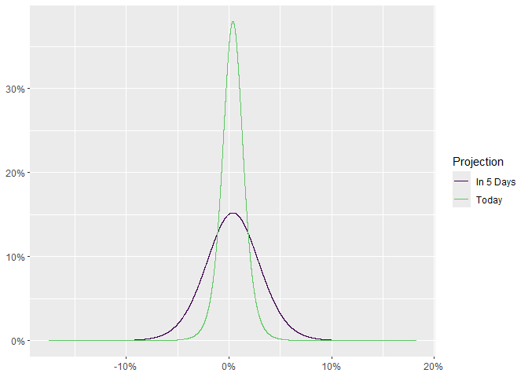

<!-- README.md is generated from README.Rmd. Please edit that file -->

# timetravel

<!-- badges: start -->

[](https://lifecycle.r-lib.org/articles/stages.html#experimental)
[](https://github.com/Reckziegel/timetravel/actions/workflows/R-CMD-check.yaml)
<!-- badges: end -->

The goal of `timetravel` is to help users to perform the third step in
Meucci’s Checklist: **Projection**.

## Installation

You can install the development version of `timetravel` from
[GitHub](https://github.com/) with:

``` r
# install.packages("devtools")
devtools::install_github("Reckziegel/timetravel")
```

## Usage

From **The Prayer**:

> … The projection step is the process of obtaining the distribution at
> the investment horizon of the relevant risk drivers from the
> distribution of the invariants and additional information available at
> the current time T.

Let’s say the statistician have already found
[invariance](https://reckziegel.github.io/invariance/) in a time-series:

``` r
# Step 1: Quest for Invariance
library(tibble)

invariance <- as_tibble(diff(log(EuStockMarkets))) 
invariance
#> # A tibble: 1,859 x 4
#>         DAX      SMI       CAC      FTSE
#>       <dbl>    <dbl>     <dbl>     <dbl>
#>  1 -0.00933  0.00618 -0.0127    0.00677 
#>  2 -0.00442 -0.00588 -0.0187   -0.00489 
#>  3  0.00900  0.00327 -0.00578   0.00903 
#>  4 -0.00178  0.00148  0.00874   0.00577 
#>  5 -0.00468 -0.00893 -0.00512  -0.00723 
#>  6  0.0124   0.00674  0.0117    0.00852 
#>  7  0.00576  0.0122   0.0131    0.00821 
#>  8 -0.00287 -0.00359 -0.00194   0.000837
#>  9  0.00635  0.0110   0.000171 -0.00523 
#> 10  0.00118  0.00436  0.00313   0.0140  
#> # ... with 1,849 more rows
```

Then, the randomness of the “market” can be estimated with
[uncover](https://reckziegel.github.io/uncover/):

``` r
# Step 2: Estimation
library(uncover)

# Say... a Student-t distribution
fit <- fit_t(.invariant = invariance)
fit
#> <list_of<double>[21]>
#> Converged:       TRUE
#> Dimension:       4
#> AIC:             -52711.16
#> Log-Likelihood:  26374.58
#> Model:           Asymmetric Student-t
```

A simulation of this characteristic process can be constructed with
`simulate_margins`:

``` r
fit_simul <- simulate_margins(model = fit, n = 100000)
fit_simul
#> # A tibble: 100,000 x 4
#>          DAX      SMI      CAC      FTSE
#>        <dbl>    <dbl>    <dbl>     <dbl>
#>  1  0.0153    0.0130   0.0142   0.0103  
#>  2  0.0146    0.00934  0.0157   0.0102  
#>  3 -0.0195   -0.0200  -0.0267  -0.00928 
#>  4  0.00929   0.0140   0.00776  0.00475 
#>  5  0.000635 -0.00255  0.00405 -0.00188 
#>  6  0.0149    0.0170   0.0347   0.0213  
#>  7  0.00675   0.00195  0.00199 -0.000436
#>  8  0.00429   0.00944 -0.0122   0.00147 
#>  9 -0.0151   -0.00297 -0.00552 -0.00119 
#> 10  0.0133    0.0113   0.00407  0.0139  
#> # ... with 99,990 more rows
```

The `timetravel` package provides the family of functions `project_*()`
in order to make projection step easier:

``` r
# Step 3: Projection
library(timetravel)

prjct2 <- project_t(.invariant = fit_simul, .horizon = 2, .n = 100000)
prjct2
#> # A tibble: 100,000 x 4
#>         DAX       SMI      CAC     FTSE
#>       <dbl>     <dbl>    <dbl>    <dbl>
#>  1  0.00911 -0.0107    0.0134  -0.0146 
#>  2  0.00234  0.0145    0.0359  -0.0307 
#>  3 -0.0213   0.00247  -0.00139  0.0155 
#>  4  0.0281   0.00385  -0.0236   0.00451
#>  5 -0.0352   0.0148    0.00175  0.00459
#>  6  0.0221  -0.0115    0.0354  -0.0149 
#>  7  0.0197  -0.000927  0.0105   0.00213
#>  8 -0.0173   0.00567  -0.00844  0.0180 
#>  9  0.0304   0.00639  -0.0132  -0.0248 
#> 10 -0.00742 -0.000116  0.0118  -0.0188 
#> # ... with 99,990 more rows

prjct5 <- project_t(.invariant = fit_simul, .horizon = 5, .n = 100000)
prjct5
#> # A tibble: 100,000 x 4
#>         DAX       SMI      CAC      FTSE
#>       <dbl>     <dbl>    <dbl>     <dbl>
#>  1  0.0117   0.0264   -0.00874 -0.00694 
#>  2 -0.0277   0.0203    0.0423  -0.000148
#>  3 -0.0423   0.00442   0.0349   0.000215
#>  4  0.0301  -0.00111   0.0343   0.00844 
#>  5 -0.00445  0.0266    0.00521 -0.0517  
#>  6 -0.00387 -0.00343  -0.0111   0.00311 
#>  7  0.0350  -0.0140   -0.0182   0.0401  
#>  8 -0.0133   0.00545   0.00874 -0.0377  
#>  9 -0.0306   0.000990 -0.0432   0.0207  
#> 10 -0.00754  0.0497   -0.0293  -0.0234  
#> # ... with 99,990 more rows
```

In witch the `autoplot` method is available:

``` r
library(ggplot2)

# 2 days ahead
autoplot(prjct2) + 
  scale_color_viridis_d(end = 0.75)
```


``` r
# 5 days ahead
autoplot(prjct5) + 
  scale_color_viridis_d(end = 0.75)
```



For more information on projection, please, see the reference page.

## References

-   Meucci, Attilio, ‘The Prayer’ Ten-Step Checklist for Advanced Risk
    and Portfolio Management (February 2, 2011). Available at SSRN:
    <https://ssrn.com/abstract=1753788> or
    <http://dx.doi.org/10.2139/ssrn.1753788>
