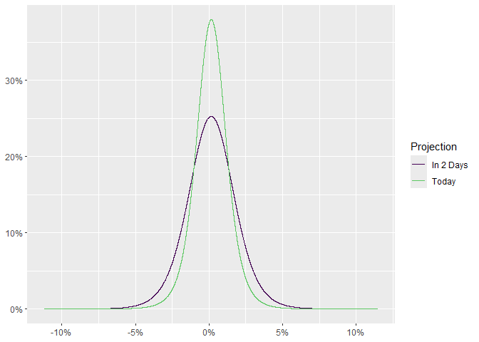

<!-- README.md is generated from README.Rmd. Please edit that file -->

# timetravel

<!-- badges: start -->

[](https://lifecycle.r-lib.org/articles/stages.html#experimental)
[](https://github.com/Reckziegel/timetravel/actions/workflows/R-CMD-check.yaml)
<!-- badges: end -->

The goal of `timetravel` is to help users to perform the third step in
Meucci’s Checklist: **Projection**.

## Installation

You can install the development version of `timetravel` from
[GitHub](https://github.com/) with:

``` r
# install.packages("devtools")
devtools::install_github("Reckziegel/timetravel")
```

## Usage

From **The Prayer**:

> … The projection step is the process of obtaining the distribution at
> the investment horizon of the relevant risk drivers from the
> distribution of the invariants and additional information available at
> the current time T.

Let’s say the statistician have already found
[invariance](https://reckziegel.github.io/invariance/) in a time-series:

``` r
# Step 1: Quest for Invariance
library(tibble)

invariance <- as_tibble(diff(log(EuStockMarkets))) 
invariance
#> # A tibble: 1,859 x 4
#>         DAX      SMI       CAC      FTSE
#>       <dbl>    <dbl>     <dbl>     <dbl>
#>  1 -0.00933  0.00618 -0.0127    0.00677 
#>  2 -0.00442 -0.00588 -0.0187   -0.00489 
#>  3  0.00900  0.00327 -0.00578   0.00903 
#>  4 -0.00178  0.00148  0.00874   0.00577 
#>  5 -0.00468 -0.00893 -0.00512  -0.00723 
#>  6  0.0124   0.00674  0.0117    0.00852 
#>  7  0.00576  0.0122   0.0131    0.00821 
#>  8 -0.00287 -0.00359 -0.00194   0.000837
#>  9  0.00635  0.0110   0.000171 -0.00523 
#> 10  0.00118  0.00436  0.00313   0.0140  
#> # i 1,849 more rows
```

Then, the randomness of the “market” can be estimated with
[uncover](https://reckziegel.github.io/uncover/):

``` r
# Step 2: Estimation
library(uncover)

# Say... a Student-t distribution
fit <- fit_t(.invariant = invariance)
fit
#> <uncover_fit[21]>
#> Converged:       TRUE
#> Dimension:       4
#> AIC:             -52711.16
#> Log-Likelihood:  26374.58
#> Model:           Asymmetric Student-t
```

A simulation of this characteristic process can be constructed with
`simulate_margins`:

``` r
fit_simul <- simulate_margins(model = fit, n = 100000)
fit_simul
#> # A tibble: 100,000 x 4
#>          DAX       SMI      CAC      FTSE
#>        <dbl>     <dbl>    <dbl>     <dbl>
#>  1  0.0140    0.00613   0.0109  -0.00299 
#>  2  0.00691  -0.000953 -0.00856 -0.00385 
#>  3 -0.0124   -0.00885  -0.0110  -0.0121  
#>  4 -0.0128   -0.0113   -0.0145  -0.0134  
#>  5  0.0118    0.0144   -0.00221  0.000536
#>  6 -0.00163  -0.00985  -0.00161 -0.00582 
#>  7  0.000489  0.00441  -0.00551  0.00333 
#>  8 -0.00636  -0.00637  -0.00464 -0.00934 
#>  9  0.00432   0.00224   0.0111   0.0119  
#> 10  0.00810   0.00344   0.0145   0.00434 
#> # i 99,990 more rows
```

The `timetravel` package provides the family of functions `project_*()`
in order to make projection step easier:

``` r
# Step 3: Projection
library(timetravel)

prjct2 <- project_t(.invariant = fit_simul, .horizon = 2, .n = 100000)
prjct2
#> # A tibble: 100,000 x 4
#>         DAX      SMI      CAC      FTSE
#>       <dbl>    <dbl>    <dbl>     <dbl>
#>  1 -0.00427 -0.0282  -0.0369  -0.0146  
#>  2  0.0266   0.00199 -0.00483  0.0120  
#>  3  0.0231   0.00494  0.00400 -0.00538 
#>  4  0.00690 -0.00486  0.0132  -0.0215  
#>  5  0.0105   0.0260   0.0248   0.00385 
#>  6  0.00204 -0.0262  -0.00939  0.00342 
#>  7  0.0192   0.0403  -0.0215   0.0101  
#>  8  0.00105 -0.0226  -0.0106   0.00154 
#>  9 -0.0254  -0.00848  0.0270  -0.000536
#> 10  0.00734 -0.0186  -0.00491  0.00597 
#> # i 99,990 more rows

prjct5 <- project_t(.invariant = fit_simul, .horizon = 5, .n = 100000)
prjct5
#> # A tibble: 100,000 x 4
#>          DAX      SMI      CAC     FTSE
#>        <dbl>    <dbl>    <dbl>    <dbl>
#>  1 -0.0138    0.0114   0.0161   0.00694
#>  2 -0.000726 -0.0323   0.0300   0.00209
#>  3  0.000105 -0.00773  0.0151  -0.00442
#>  4  0.0248   -0.0147  -0.0199  -0.0228 
#>  5 -0.00128  -0.0102  -0.0269  -0.0148 
#>  6  0.00533  -0.00944  0.0120   0.00445
#>  7  0.0113    0.0307   0.0296   0.00541
#>  8  0.0119    0.0396  -0.0490  -0.0230 
#>  9 -0.0298    0.0385   0.0225   0.00264
#> 10 -0.0155    0.0366   0.00443 -0.0127 
#> # i 99,990 more rows
```

In witch the `autoplot` method is available:

``` r
library(ggplot2)

# 2 days ahead
autoplot(prjct2) + 
  scale_color_viridis_d(end = 0.75)
```



``` r

# 5 days ahead
autoplot(prjct5) + 
  scale_color_viridis_d(end = 0.75)
```


For more information on projection, please, see the reference page.

## References

- Meucci, Attilio, ‘The Prayer’ Ten-Step Checklist for Advanced Risk and
  Portfolio Management (February 2, 2011). Available at SSRN:
  <https://ssrn.com/abstract=1753788> or
  <http://dx.doi.org/10.2139/ssrn.1753788>
